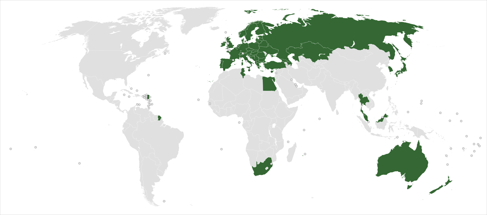
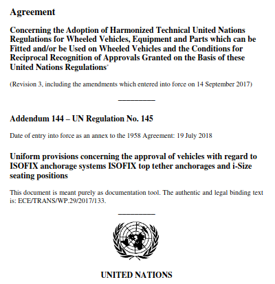
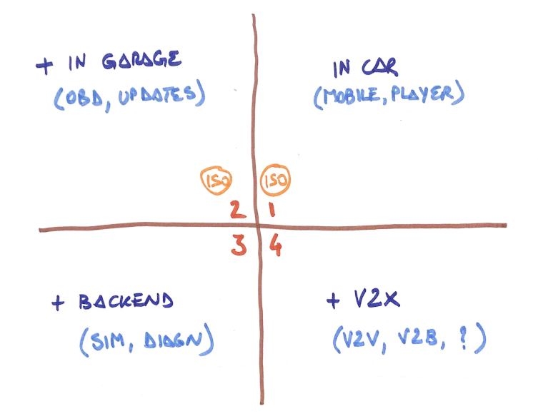
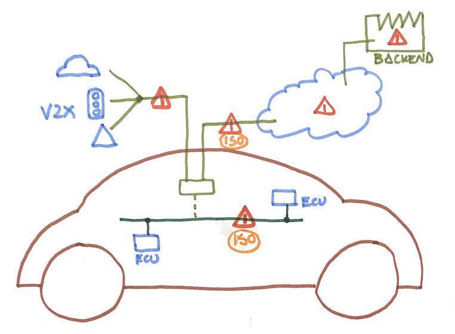
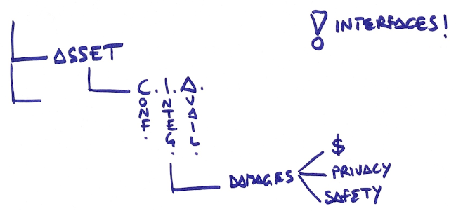
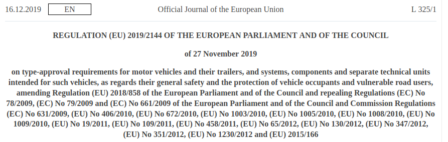
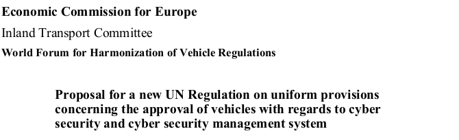
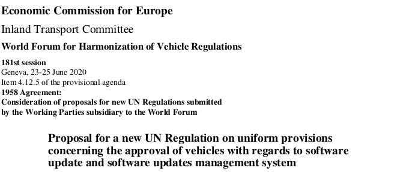
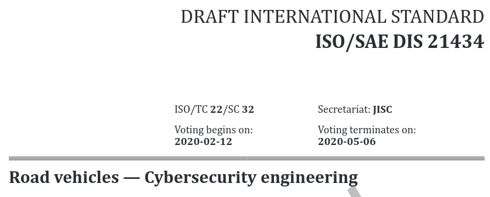

layout: true
.footer[
Cyber security on vehicles: status 2021
]

---

.center[
# Cyber security on vehicles

# Status, 2021
]

---

.left-column[
## Content
]

.right-column[

.middle[
1. Background on vehicles regulations
2. Cyber security on vehicles
3. New (draft) regulations and standards
]
]

---

.center[
# 1. BACKGROUND ON VEHICLES REGULATIONS
]

---

.left-column[
## Background on vehicles regulations
]

.right-column[
### Omologation of a new vehicle: role of WP.29 (1/3)

The United Nations Economic Commission for Europe (UNECE) World Forum for Harmonization of Vehicle Regulations (also known as WP.29) is a unique worldwide regulatory forum within the institutional framework of the UNECE Inland Transport Committee.

https://unece.org/transport/vehicle-regulations

.pull-left[
* Develops regulatory requirements for safety and environmental performance
* Working Parties provide technical oversight and expertise for development of regulations
]

]

---

.left-column[
## Background on vehicles regulations
]

.right-column[

### Omologation of a new vehicle: role of WP.29 (2/3)

Legal framework provided by three historical agreements.

*Member countries* attending the WP.29 sessions can establish regulatory instruments concerning vehicles.

.pull-left[
* UN Regulations, annexed to the 1958 Agreement
* United Nations Global Technical Regulations (UN GTRs), associated with the 1998 Agreement
* UN Rules, annexed to the 1997 Agreement
]

]

---

.left-column[
## Background on vehicles regulations
]

.right-column[

### Omologation of a new vehicle: role of WP.29 (3/3)

Regulatory proposals are documented per month, year on website. Each regulation is known as a *UN ECE Rxxx* document (xxx=number) discussed in one of the WP.29 *working parties* (subsidiary bodies):

.pull-left[
* GRBP: Noise and Tires
* GRPE: Engine, Emissions, Energy
* GRE: Lighting and Light-Signaling
* GRVA: Automated/Autonomous and Connected Vehicles
* GRSP: Passive Safety
* GRSG: General Safety Construction
]

]

---

.center[
# 2. CYBER SECURITY ON VEHICLES
]

---

.left-column[
## Cyber security on vehicles
]

.right-column[
### Vehicles generations

]

---

.left-column[
## Cyber security on vehicles
]

.right-column[
### Components and threats

.pull-left[

]

]

---

.center[
# 3. NEW (DRAFT) REGULATIONS AND STANDARDS
]

---

.left-column[
## New (draft) regulations and standards
]

.right-column[

### New General Safety Regulation (GSR) published as 2019/2144 (1/4)

The new *GSR 2019/2144*

https://eur-lex.europa.eu/eli/reg/2019/2144/oj

]

---

.left-column[
## New (draft) regulations and standards
]

.right-column[

### New General Safety Regulation (GSR) published as 2019/2144 (2/4)

In the news

> The original General Safety Regulation, EC Regulation No. 661/2009, was published on 31st July 2009...
> the European Commission drafted a completely new version of the General Safety Regulation...
> it was not until 16th December 2019 that the new Regulation was finally published...
> as EU Regulation No. 2019/2144.

https://www.interregs.com/articles/spotlight/new-eu-general-safety-regulation-published-000213
]

---

.left-column[
## New (draft) regulations and standards
]

.right-column[

### New General Safety Regulation (GSR) published as 2019/2144 (3/4)

Consequences of the new *GSR 2019/2144*:

1. New UN ECE Regulations on Components Introduced
2. New UN ECE Regulations on Occupant Protection Introduced
3. Scope of Existing UN ECE Regulations Expanded
4. New Features Requiring New Regulatory Requirements to be Developed

]

---

.left-column[
## New (draft) regulations and standards
]

.right-column[

### New General Safety Regulation (GSR) published as 2019/2144 (4/4)

A lot of additional safety components need to be installed on newly developed vehicles .red[starting 2022] (detailed in many Regulations). Relevant examples:

.pull-left[
* Advanced emergency braking systems (AEBS) capable of detecting vehicles, stationary obstacles, pedestrians and cyclists
* Revering cameras
* Emergency lane keeping systems
* Alcohol interlock
* Driver drowsiness and attention detection systems
]

.pull-right[
* .red[Protection against cyber-attacks]
* Driver availability monitoring systems
* Systems to replace the driver’s control
* Systems to monitor the area surrounding the vehicle
* Systems to provide safety information to other road users
* Communication systems and protocols for platooning
]

]

---

.left-column[
## New (draft) regulations and standards
]

.right-column[

### Detailed regulations for protection against cyber-attacks (1/2)

Among the regulations .red[effective 4/2022] thanks to the new *GSR 2019/2144* are very detailed Cyber Security enforcing guidelines.

* R155: Proposal for a new UN Regulation on uniform provisions concerning the approval of vehicles with regards to cyber security and cyber security management system
* R156: Proposal for a new UN Regulation on uniform provisions concerning the approval of vehicles with regards to software update and software updates management system

.pull-left[

]

]

---

.left-column[
## New (draft) regulations and standards
]

.right-column[

### Detailed regulations for protection against cyber-attacks (2/2)

* R155 and R156 consider the full lifecycle of a vehicle from the cyber security point of view
* the *process* and not the *algorithms* or *implementations* is taken into account (similar to Functional Safty)
* ISO 26262-2018 (functional safety), ISO/PAS 21448 (safety of the intended functionality) and .red[ISO/SAE 21434] (cybersecurity engineering) are explicitly recalled
* ISO/SAE 21434 is the brand new approach to cybersecurity engineering for vehicles, closely resembling ISO 26262-2018

]

---

.left-column[
## People
]

.right-column[

.middle[
* *stefano.costa@bluewind.it*
* Partner and Director of Engineering
* https://www.bluewind.it
]
]
